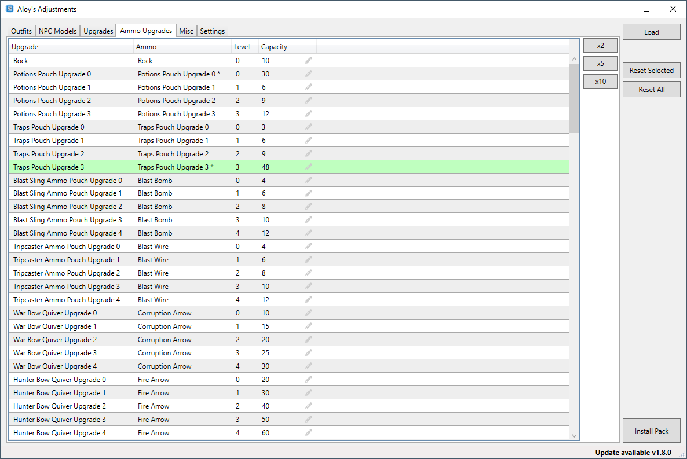
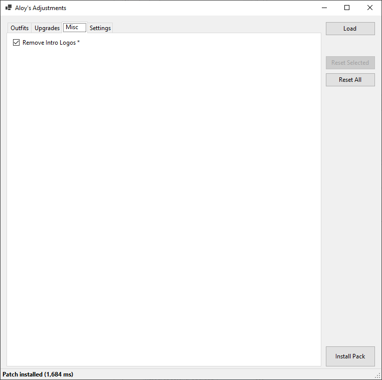
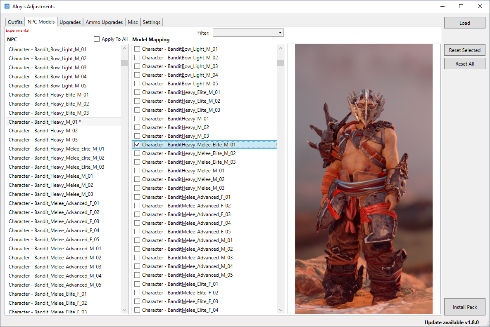

# Aloy's Adjustments
Change characters, swap outfits and more. Mods for Horizon Zero Dawn.  
It creates patch files for Horizon Zero Dawn and doesn't edit exiting game files.

## Setup
- If you have Horizon Zero Dawn on Steam it should be detected and setup automatically. Otherwise follow the 2 steps below. 
- In settings, set the game folder to the Horizon Zero Dawn main directory (ex. `E:\Games\SteamLibrary\steamapps\common\Horizon Zero Dawn`)
- In settings, click `Get Oodle DLL` which will copy the required dll from the game folder

## Usage
- Make sure the game is not running.
- Make the desired changes and click `Install Pack`. This will copy the patch file to the game folder.
- Play Horizon Zero Dawn.

### Plugins
#### Outfits (Swaping character and outfit models)
Select the outfit(s) you want to modify from the right `Outfits` list.  
Check-off the new model for the outfit(s) on the left `Model Mapping` list.  
Use the filter in the top right to see all character options
  

#### Upgrade (Change resource upgrades)
Upgrade values are the increased capacity that the upgrade provides, not the absolute value.  
Values can be changed by entering a new number in the grid.  
The multipler buttons will apply a multiplier to all selected upgrades.  
  

#### Ammo (Change ammo capacity)
Unlike upgrade ammo is the absolute value that Aloy can carry.
Ammo upgrade 0 is the default amount of ammo Aloy can carry before any upgrades.
Values can be changed by entering a new number in the grid.  
The multipler buttons will apply a multiplier to all selected upgrades.  
  

#### Miscellaneous
Misc plugin contains items that don't belong anywhere else.
The options are self explanitory.
  

#### NPC Models (Swaping npc character models)
Select the npc(s) you want to modify from the right `NPC` list.  
Check-off the new model for the npc(s) on the left `Model Mapping` list.  
Use the filter in the top right to see all character options
  

### Side Buttons:  
| Button  | Description |
| --- | --- |
| Install Pack | Creates a bin file with the changes and installs it into the games `Packed_DX12` folder |
| Reset Selected | Resets the current item to its default value |
| Reset All | Resets all items in the current tab to their default values |
| Load | Loads an existing pack file |

## Troubleshooting
Status and errors are displayed in the bottom left. There isn't a lot of validation if things break restart the program.  
Not all outfit/character swaps have been tested. If the game doesn't load or Aloy looks the same the swap didn't work.  
If the game won't load or the app won't load try deleting the patch file. The patch is placed in `%GameDir%\Packed_DX12\Patch_AloysAdjustments.bin`.  
If you change the bin file name or move it, be sure to update `config.json` with the new name, otherwise the program can't get the original game files.

## Special Thanks
Nukem9 - HZDCoreEditor, Throubleshooting Help  
derwangler - Model swap method
